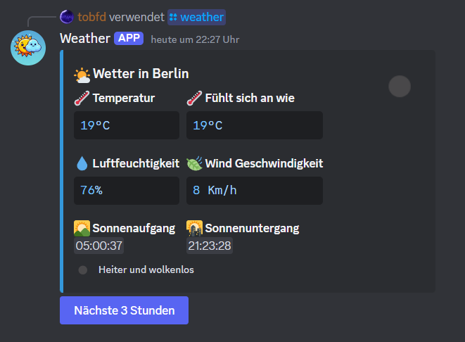
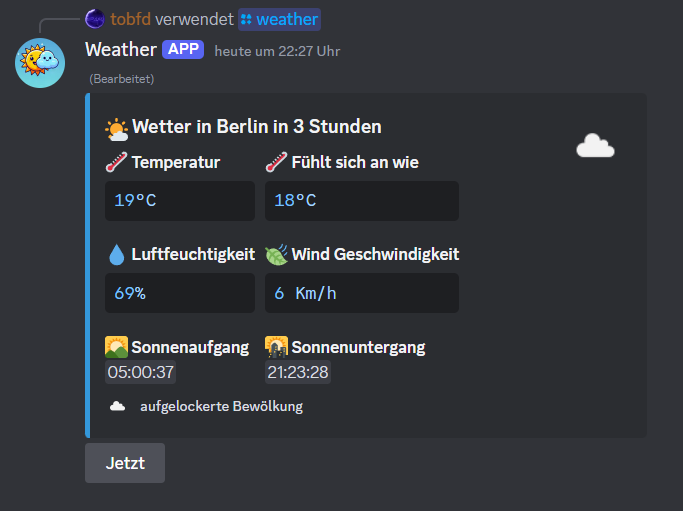

# Wetter Discord Bot

Der Bot ist in Python mit py-cord und ezcord programmiert wurden.


## Testen
Ihr könnt den Bot auf eurem Server einladen und testen mit dem folgendem [Link](https://discord.com/oauth2/authorize?client_id=1262014442326069288).
## Funktionen
Mit ```/weather``` können Informationen über das Wetter abgerufen werden darunter sind:
- Temperatur
- gefühlte Temperatur
- Luftfeuchtigkeit
- Wind Geschwindigkeit
- Sonnenaufgang
- Sonnenuntergang
- Ein Bild mit der Wettersituation
- Eine Beschreibung der Wetterlage

dann noch dasselbe für die nächsten 3 Stunden.
Hier ein Bild vom Command:  
  
Und dann noch in den Nächsten 3 Stunden:  


Man kann per Button immer wieder von der jetzigen Wettervorhersage zur der in den nächsten 3 Stunden springen.

Der Bot wurde im Zusammenhang mit dem Hackathon von [Kevin Chromik](https://www.youtube.com/@KevinChromik) erstellt.

## Installation
1.
````
pip install -r requirements.txt
````
2.
Eine ``.env`` erstellen und Token aus dem Discord Developer Portal einfügen und den API KEY von OPWM siehe ``.env.example``.
3.
DIe ``main.py`` starten.
